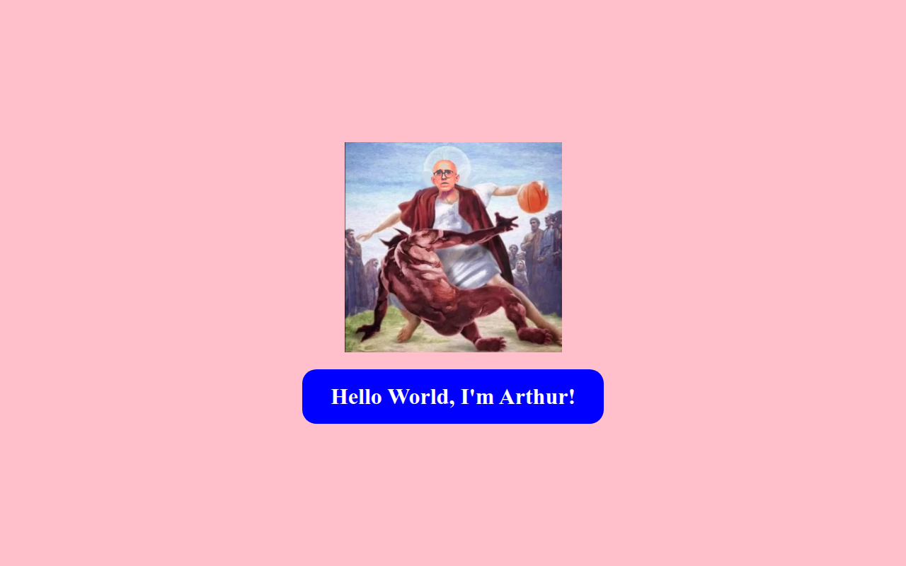

# DIW - Aula 02

## Ambiente de trabalho com git e GitHub

**Arthur Victor Alves - Matrícula: 911060**

Atividade complementar à Aula 01: configuração do ambiente de desenvolvimento
(VS Code, Git e GitHub), uso de branches e integração com o repositório remoto.

---

### Inspeção de conexão com as ferramentas de desenvolvedor

Print da aba **Network** (Rede) das ferramentas de desenvolvedor do navegador,
mostrando os arquivos necessários para a montagem da página de um portal.

---

### Resultado do index.html no navegador

Print da página `index.html` renderizada no navegador.

